Saiba mais sobre o tradicional conceito e o papel de novas tecnologias que fazem uma revolução em sinalização digital. 

* Atenção: este é um documento que está sendo atualizado com contribuições de várias pessoas e tem o objetivo de servir como referência para desenvolvimento e visar contribuição em especificação de requisitos em sistemas de sinalização digital. Se você quer ser um autor conjunto por favor enviar um e-mail para adm em telasocial ponto com.  

## Conceito geral de sinalização digital 

Sinalização digital é um termo utilizado para descrever sistemas de apresentação visual que possuem painéis eletrônicos, como painéis de LED, LCD. Grande parte destes sistemas foram utilizados para propaganda mas destacam-se casos de uso emergentes para fins informativos - por exemplo em autovias. Também é emergente o uso de sistemas de sinalização digital que utilizam das tecnologias web assim a experiência do usuário é mais dinâmica e melhorias podem ser colocadas em espaços públicos e semi-públicos.
## Casos de uso  

Abaixo tem-se uma coleção de casos de uso em sinalização digital que foram obtidos por meio do projeto TelaSocial e por meio da observação de outros sistemas. O objetivo é coletar informações sobre os vários usos destes sistemas e assim que possamos detectar problemas e oportunidades. 

### Multi telas verticais com redes sociais

O exemplo de sinalização abaixo é baseado no caso do [TelaSocial no Evento Anprotec 25 anos](http://blog.telasocial.com/12-telas-em-tempo-real-no-seminario-nacional) e mostra uma configuração do tipo "central de informações" onde o usuário pode saber dos vários tipos de eventos que acontecem — tudo em tempo-real. O exemplo conta com Twitter, mapa do evento, paineis com patrocinadores, notícias via RSS e também a agenda do evento em tempo-real. 

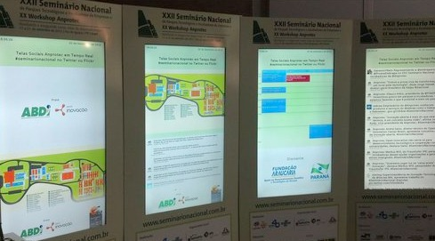

### Tela de gestão com visualização em tempo-real de 12

O caso de uso abaixo é de um evento que foi realizado para mais de 1000 pessoas e onde os sistemas de sinalização digital utilizaram 12 telas. Esta foi uma configuração onde cada terminal (computador ligado nas telas) fazia a captura da tela e permitia a transmissão via o padrão Web, assim possibilitando que uma interface de adminstração pudesse obter a visualização de todas as telas com atualizações a cada 15 segundos. 

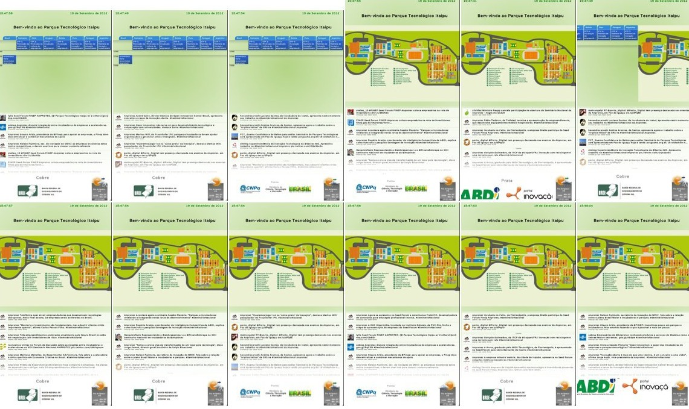

### Caso de uso de painel de sinalização digital em tempo-real com uso de painel de sinalização visual com comunicação visual impressa

Neste caso pode-se observar que a parte dos patrocinadores (os previamente definidos) foram impressas no totem. Durante o decorrer do evento surgiram novas demandas de patrocínio assim alguns patrocinadores foram adicionados por meio de um canal online Web na barra inferior do sistema de comunicação visual digital. 

### Caso de uso de sistema de sinalização digital interativa com agenda de eventos paralelos

O exemplo abaixo mostra um sistema interativo de sinalização digital que busca as informações da agenda em tempo real, ou seja, quando a programação é alterada pode-se obter uma atualização rápida nas telas no evento. Observa-se que a agenda também apresenta a programação de 9 telas ao mesmo tempo. A programação vai "subindo" com o tempo, ou seja, apresenta-se a partir do momento atual (menos 1-2 horas para que o usuário possa entender o que está acontecendo)

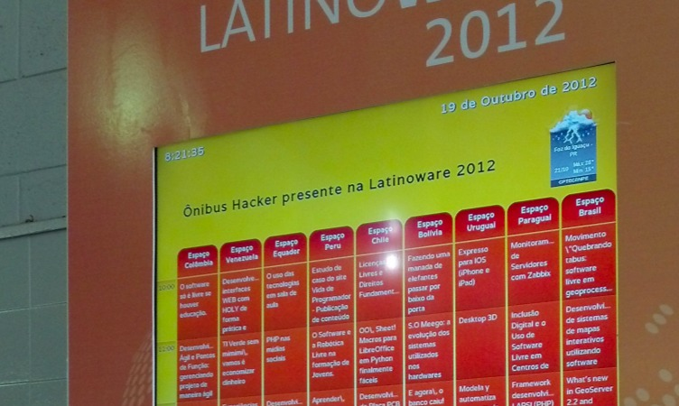

### Aparelho de TV com bordas reduzidas e proporcionais 

O caso de uso abaixo mostra um sistema de sinalização digital que está sendo instalado em um aparelho tipo Samsung que tem bordas proporcionais. Este caso de uso é interessante pois traz um visual que é agradável para usuários. 

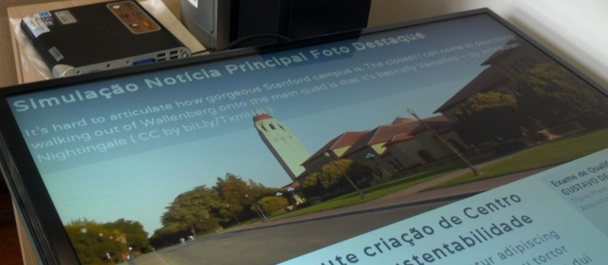

### Sistema de sinalização com WIFI em Intranet em bloco interno

O sistema abaixo é um caso de uso do Parque Tecnológico Itaipu e mostra um painel de sinalização digital que apresenta um conteúdo vinculado com a intranet da instituição. Cada terminal tem um mini-pc que faz a conexão via WIFI em uma VPN da instituição por meio da rede e autenticação 802.11x. Uma vez que o terminal faz o "boot" ele carrega informações que mostram a agenda das salas na instituição, ou seja, está atrelado com o sistema existente na instituição para fins de reservas das salas. 

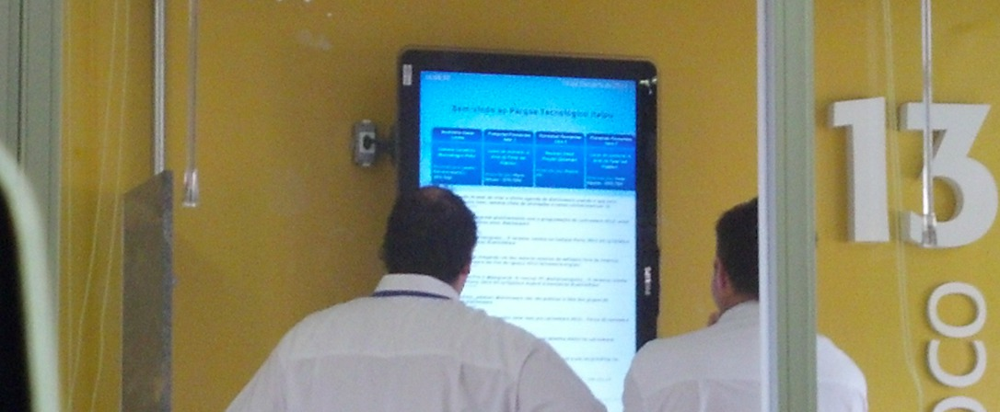

A foto abaixo mostra que o terminal está próximo do "access point" que proporciona a infra-estrutura de rede: 

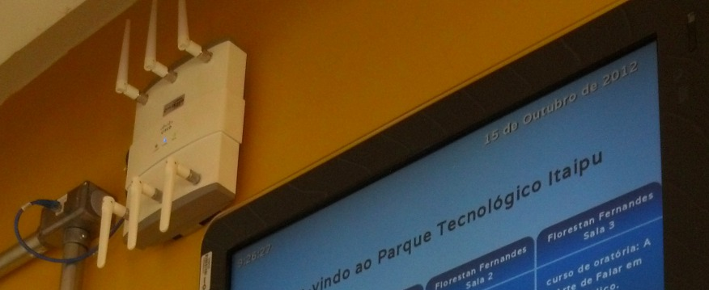

É importante observar que o suporte WIFI pode apresentar mais um possível ponto de falha. O caso acima, no Parque Tecnológico Itaipu, é um caso de testes e mostrou performance razoável porque a rede da fundação tem uma qualidade muito boa de sinal e estabilidade no serviço. Isto não é o caso em geral assim recomenda-se o uso de cabos como ethernet. 

## Erros comuns ou preocupações  

### Pop-ups de notificação do sistema operacional estão atrapalhando o visual de sistema em aeroporto 

A foto abaixo, tirada em 2012 no Brasil (antes dos aeroportos privados) mostra que o sistema de sinalização digital do aeroporto está sendo executado com base no sistema operacional Windows. E como o sistema é uma versão originalmente elaborada para usuários (como os usuários na frente do computador com o mouse) pode-se observar problemas como estes balões de notificação. 

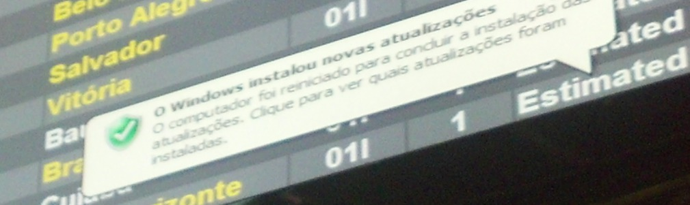

### Vários casos de uso de problemas onde elementos de interface do sistema operacional estão atrapalhando o conteúdo

No exemplo abaixo destacam-se casos de sistemas de sinalização visual em aeroportos que apresentam problemas entre a interface desejada e recursos do sistema operacional. As fotos abaixo foram observadas no período de 2012 e representam preocupações e atenção sobre o que não deve-se fazer.

<iframe width="100%" height="515" src="http://www.youtube.com/embed/396jaJ0Grhc" frameborder="0" allowfullscreen></iframe>

### Caso de uso de várias aplicações em conflito com o espaço visual do sistema de sinalização digital

O caso abaixo mostra uma "pop-up" do sistema operacional e ainda uma janela de erro de uma aplicação Java. Em vários sistemas de sinalização digital pode-se ver esse tipo de comportamento que é atrelado ao fato que os sistemas tem o seu funcionamento como aplicação em sistema do sistema de janelas que foi originalmente criado para usuários — tipo com o mouse. Assim observa-se que existem botões ou opções para o uso do mouse, o que é um grande problema já que sistemas de qualidade tem que oferecer uma experiência de adminstração remota. 

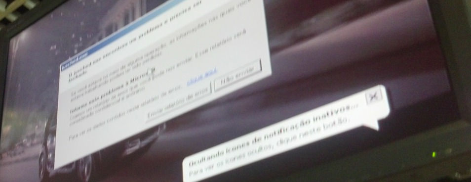

### Fundo do Windows é apresentado em sinalização digital com multi-telas em aeroporto 

No caso abaixo pode-se observar que o sistema de telas do aeroporto é baseado no sistema operacional Windows. Devido a um problema de configuração ou programação, os usuários tem uma experiência que não é a desejada. Este tipo de problema é crítico em um ambiente como um aeroporto. 

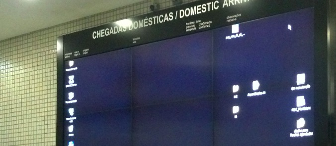

### Falta de programação alternativa

O caso abaixo mostra uma experiência que é razoável caso não exista realmente uma programação alternativa. Este não trata-se de um erro porque existem casos onde o adminstrador não fez a definição de programação alternativa. Mas é importante a observação que não é uma experiência agradável para o usuário. 

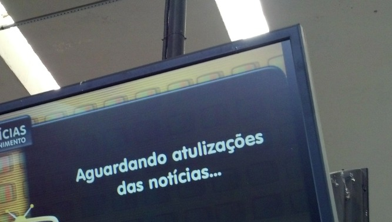

* Estamos desconsiderando o erro de português que é algo mais crítico ainda pois esta tela estava em um local público e assim "educando" as pessoas. 

### Mensagem de erro técnica em inglês 

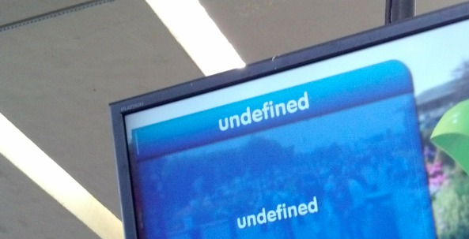

### Ninho de pomba na sinalização digital 

As fotos abaixo foram coletadas na rodoviária em São Carlos e mostram que TVs de sinalização digital foram utilizadas por pombos como um lar. Estes aparelhos estavam em uma altura razoavelmente próximas aos humanos assim trata-se de um caso de uso que apresenta perigo para usuários e também perigo ao próprio animal. 

O ninho da pomba foi feito no meio de dois aparelhos de TV: 

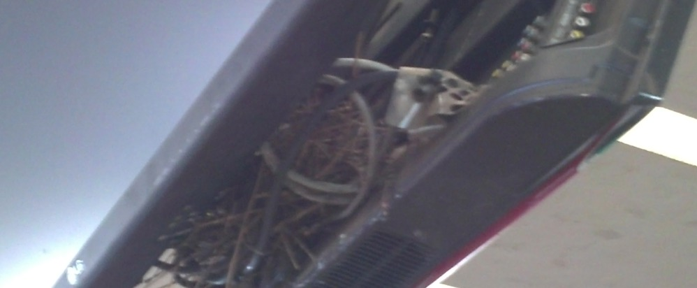

### Gigantesco painel de LED ilegível 

O caso abaixo mostra um painel gigante de LED que é praticamente ilegível. Mas neste caso ficou até interessante porque no conteúdo está apresentada a barra do Windows e como se não bastasse ainda tem uma "pop-up" do Windows com alguma mensagem que estaria atrapalhando o conteúdo. 

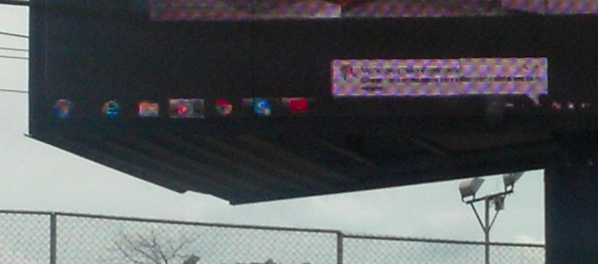

### Sistema de sinalização digital com Linux com janela de atualização

O caso abaixo é típico nos sistemas Windows e mostra um erro grave onde a aplicação de sinalização digital tem o funcionamento "em cima" do sistema gerenciador de janelas do Linux. Assim existe sempre um provável risco onde aplicações do sistema operacional vão estar em funcionamento e podem criar eventos de interrupção na tela "do usuário". No caso, o sistema está esperando uma interação do usuário para efetuar atualizações. 

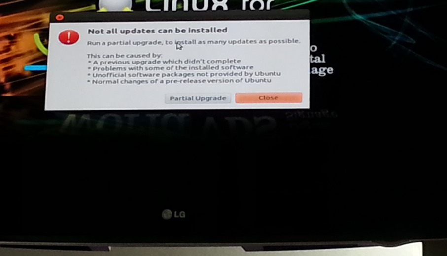
* Foto enviada por Fernando Muniz @ [dicionário informal](http://www.dicionarioinformal.com.br)

## Referências 

* [Sinalização Digital - Digital Signage Wikipedia](http://pt.wikipedia.org/wiki/Digital_Signage) 
