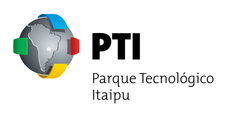
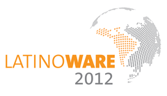
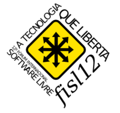
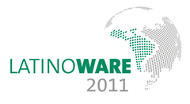

Conheça alguns dos projetos elaborados com nossos parceiros e clientes, e como as soluções Taboca Labs/TelaSocial se adequam aos vários casos de uso. 

## 
 
 

## Parque Tecnológico Itaipu

 

O Parque Tecnológico Itaipu levou o Tela Social para dentro dos corredores com o objetivo de comunicar informações relevantes para funcionários e usuários em dependências da instituição. O primeiro caso de uso foram as telas que apresentam informações sobre reservas de salas no espaço de eventos do PTI. 

## Latinoware 2012 

O Tela Social aconteceu novamente durante a Latinoware 2012 em Foz do Iguaçú, no Paraná. Na versão 2012 as telas da Latinoware estavam apresentando toda a agenda do evento em tempo real por meio do uso do padrão iCalendar, ou seja, com conectividade direta com o sistema de gestão de eventos na Latinoware (lapsi).

 

## FISL 12

 

O FISL foi o primeiro grande evento que ofereceu suporte para o Tela Social. O pojeto foi elaborado em modelo de parceria e permitiu a validação sobre pontos fortes e melhorias. 

## Latinoware 2011

 

O trabalho realizado com cerca de 11 telas e para mais de 3500 participantes em Foz do Iguaçú. A proposta foi em estabelecer um meio de comunicação dinâmico e adaptável aos eventos, como palestra, durante os 3 dias de evento. O projeto dos painéis na Latinoware teve a preocupação de deixar todo o investimento, quanto a mudanças em código e novos módulos, disponível para a comunidade.

<a href='http://blog.telasocial.com/telasocial-latinoware-2011'>Saiba mais</a>

## Sematron @ EESC USP 

A TelaSematron, disponível no repositório GitHub.com, é uma camada de customização que utiliza do sistema TelaSocial, e atende um conjunto de objetivos colocados pelo grupo organizador do evento. O líder do projeto, Gustavo Lahr, contou com o apoio de Nelson Motta e colaboração da comissão de organização da Sematron. 

<a href='http://blog.telasocial.com/telasocial-hosted-na-sematron-viii-em-sao-car'>Saiba mais</a>

## Sobre logotipos e marcas 

Os logotipos e marcas neste site são de propriedade dos seus respectivos donos. 
