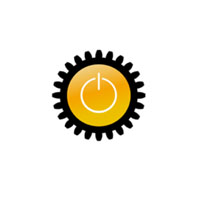

Conheça alguns dos projetos elaborados com nossos parceiros e clientes, e como as soluções Taboca Labs/TelaSocial se adequam aos vários casos de uso. 

 

O Parque Tecnológico Itaipu levou o Tela Social para dentro dos corredores com o objetivo de comunicar informações relevantes para funcionários e usuários em dependências da instituição. O primeiro caso de uso foram as telas que apresentam informações sobre reservas de salas no espaço de eventos do PTI. 

 

No Instituo de Física da USP, o projeto foi uma iniciativa da equipe SCInfor, que conta com apoio adminstrativo e tem toda a tecnologia baseada em padrões Web. A infra-estrutura é de código aberto destacando sistema Linux e conta com a tecnologia do sistema TelaSocial, também disponibilizado com código aberto. <a href='http://blog.telasocial.com/uso-dos-paineis-web-no-instituto-de-fisica-em'>Saiba mais sobre a versão original</a> e ainda <a href='http://blog.telasocial.com/novo-painel-no-ifsc-usp-em-sao-carlos'>avanços</a>.

 

Na Latinoware 2012, em Foz do Iguaçú — Paraná, a versão nova das telas contou com uma novidade — toda a agenda do evento em tempo real por meio do uso do padrão iCalendar, ou seja, contou com uma solução de integração, com uma conectividade direta com o sistema de gestão de eventos na Latinoware (lapsi).

 

O FISL foi o primeiro grande evento que ofereceu suporte para o Tela Social. O pojeto foi elaborado em modelo de parceria e permitiu a validação e capacitação do sistema com recursos específicos atendendo ao caso de eventos.  <a href='http://softwarelivre.org/fisl11/noticias/fisl11-contara-com-a-nova-tecnologia-do-telasocial'>Saiba mais sobre o projeto original</a> e também projetos de <a href='http://www.pensoti.com.br/opensource/fisl-tela-social-integre-a-web-com-seus-ambientes-fisicos'>continuação</a>.

 

Na Latinoware 2011, o Tela Social fez o primeiro projeto com maior número de telas. Foram 11 telas para mais de 3500 participantes, no evento que ocorreu dentro do Parque Tecnológico Itaipu em Foz do Iguaçú. A proposta foi em estabelecer um meio de comunicação dinâmico e adaptável aos eventos, como palestra, durante os 3 dias de evento. O projeto dos painéis na Latinoware teve a preocupação de deixar todo o investimento, quanto a mudanças em código e novos módulos, disponível para a comunidade. <a href='http://blog.telasocial.com/telasocial-latinoware-2011'>Saiba mais</a>

A TelaSematron apresentou informações em tempo real durante a Sematron em 2012 e 2011. O projeto, disponível no repositório GitHub.com, é uma camada de customização que utiliza do sistema TelaSocial, e atende um conjunto de objetivos colocados pelo grupo organizador do evento. O líder do projeto, Gustavo Lahr, contou com o apoio de Nelson Motta e colaboração da comissão de organização da Sematron.  <a href='http://blog.telasocial.com/telasocial-hosted-na-sematron-viii-em-sao-car'>Saiba mais</a> 

## Sobre logotipos e marcas 

Os logotipos e marcas neste site são de propriedade dos seus respectivos donos. 
