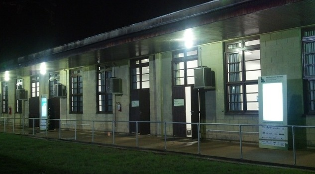
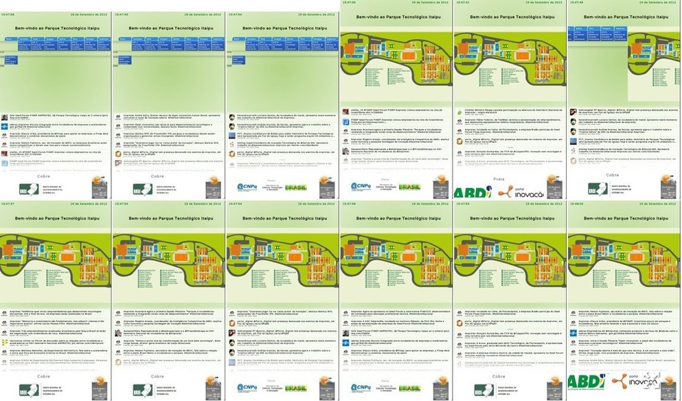
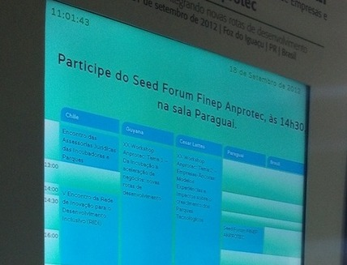
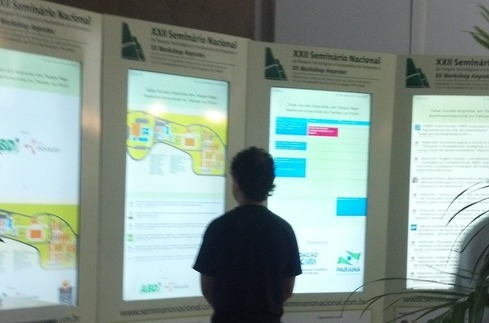
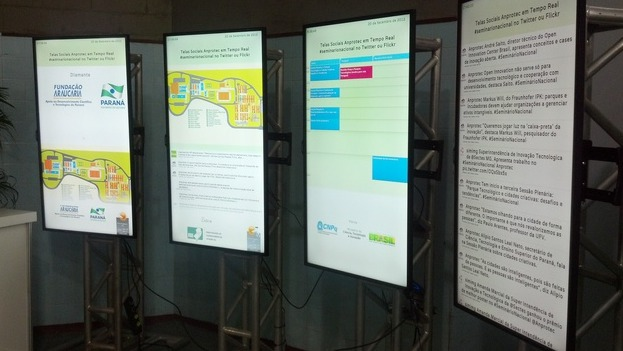

O evento XXII Seminário Nacional da Anprotec ocorreu entre os dias 16 e 21 de Setembro em Foz do Iguaçú e contou com a tecnologia do Tela Social, que proporcionou o suporte para a solução de sinalização digital com recursos em tempo real aos participantes do evento. 

## Introdução

O projeto, elaborado para a fundação Parque Tecnológico Itaipu, recebeu grande apoio dos grupos de comunicação e TI do parque. Para os usuários do evento, as principais características foram: 

1. Agenda de eventos — interligada com Google Calendar;
2. Notícia Destaque com Data e hora; 
3. Atividades da rede social Twitter — monitoramento das palavras chave; 
4. Campo com slides animados e logotipo dos patrocinadores.

No total foram utilizadas 12 TVs tipo FULL HD, espalhadas em locais estratégicos. Estes terminais foram conectados na infra-estrutura de rede WIFI que foi disponibilizada pelo grupo de TI do [PTI](http://www.pti.org.br) e também por meio de mini computadores do tipo Net top.

A imagem acima apresenta a tela de gestão com o monitoramento das imagens das 12 telas utilizadas durante o evento. As imagens são atualizadas a cada 15 segundos e enviadas para uma estação de monitoramento central que neste caso foi um laptop. 

## Uso de padrões Web e integração com calendário 

A experiência visual desenvolvida foi toda baseada em padrões Web e em conformidade com a [licença do código aberto do telaSocial](http://www.telasocial.com/codigo-fonte-licenca-de-uso/). Um dos destaques da implementação foi o componente visual de apresentação da grade de eventos, que foi elaborado para compatibilidade com o formato iCalendar que é um formato amplamente utilizado em produtos conhecidos, como o Google Calendar. Este novo recurso deixou o Tela Social mais flexível e compatível com fontes de conteúdo da rede em tempo real, o que permitiu a inserção de conteúdo baseado em agenda definida por meio de dispositivos móveis — no caso as modificações de eventos foram feitas a partir de um dispositivo celular Android permitindo maior mobilidade. 

# Experimentação Solução Multi Painéis de Sinalização Digital Interativa

No último dia do evento nosso grupo de desenvolvimento fez um projeto de experimentação com o uso de vários painéis com o objetivo de proporcionar uma experiência tipo "central de informações" em tempo real. O que mudou foi principalmente o fato que cada terminal estava com um conteúdo diferenciado com focos específicos: 

